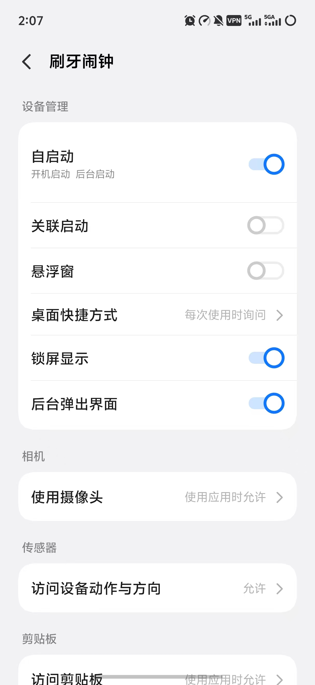
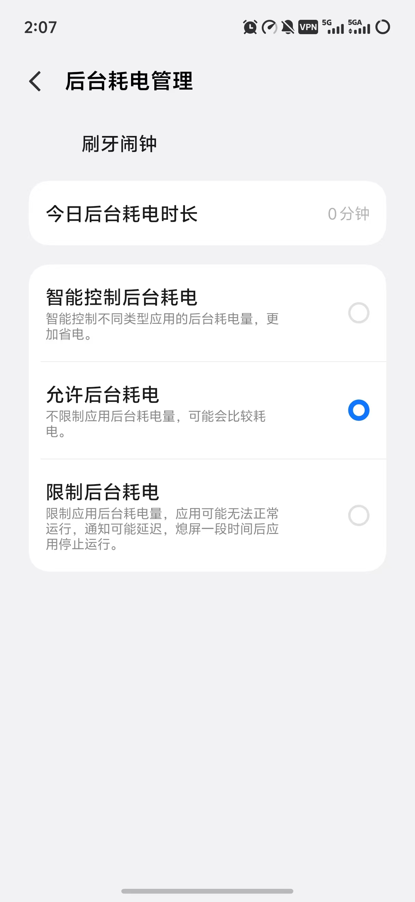

# Compatibility and Test Scope

English | [简体中文](../zh-CN/COMPATIBILITY.zh-CN.md)

## Current conclusion

Full end-to-end testing has only been completed on the maintainer's vivo X300
running Android 16 / OriginOS 6. Cross-vendor adaptation has not been completed.

That complete evidence concerns earlier releases. The persistent-session implementation
has now passed local builds and JVM unit tests. In one maintainer test on 2026-10-09,
after enabling associated-start and other background settings, a zero-volume alarm
reached the service about 35 ms after its deadline with the display off and requested
vibration. This is evidence for one delivery, not complete validation of screen-off,
Doze or recovery scenarios. The new rapid task-dismissal recovery still needs device
testing; the historical matrix does not validate these changes.

The minimum declared OS is Android 8.0 (API 26), with target SDK 35. Meeting the
minimum only means that installation is allowed; it does not validate vendor
background policy or full-screen notification behavior.

## Installation range and practical floor

- Builds produce `arm64-v8a`, `armeabi-v7a`, `x86`, `x86_64`, and universal APKs.
- Android 8.0/API 26 is the manifest-level theoretical installation floor.
- In practice, Android 10 or newer, 64-bit ARM, at least 4 GB RAM, and a
  reasonably fast performance core are recommended.
- 32-bit ARM and 2 GB devices may install, but model latency, memory use, and
  vendor background behavior have not been validated.
- x86/x86_64 primarily support emulators and do not establish real-phone
  compatibility for alarms, lock screen, or camera.
- A front camera and notification, exact-alarm, lock-screen, full-screen, and
  vendor background permissions are required.

The current model needs approximately 13.2 GMAC per window (about 26.4 GFLOP
when multiplication and addition are counted separately). The app starts at most
one inference every 0.5 seconds; sustained CPU inference must remain below
500 ms to avoid falling behind. Slower devices skip overlapping work instead of
building an unlimited queue, so they may still run but take longer to verify.
The 4 GB/64-bit ARM recommendation is conservative, not a measured hard limit
across many phones.

## Historical physical-device matrix (earlier releases)

| Scenario | vivo X300 / Android 16 / OriginOS 6 | Other devices |
|---|---|---|
| Foreground alarm opens verification | Verified | Not verified |
| Screen-off/locked alarm wakes and opens verification | Verified | Not verified |
| Alarm after dismissing the recent-task card | Verified with vendor permissions | Not verified |
| Monday–Sunday repeat selection | Manually verified | Not verified |
| Continuous and roommate modes | Manually verified | Not verified |
| Alarm restoration after reboot | Implemented; broader validation needed | Not verified |
| Automatic recovery after system Force stop | Android does not allow it | Android does not allow it |
| Recognition across people, lighting, and toothbrushes | Insufficient samples | Not verified |

Current changes require fresh checks with both nonzero and zero alarm volume:
screen off/unlocked, screen off/locked, screen staying black with full-screen UI
denied, long idle/Doze, absent process, and reboot before first unlock. Also check
task dismissal, actual PID-changing process death, quiet at second 59, FIFO,
clock/timezone changes and two recovery cycles after completion. Apart from the single zero-volume screen-off delivery above, these scenarios still
lack complete device validation. Force Stop remains a system boundary.

## Recommended report information

Include the following in a compatibility Issue:

- Phone brand and complete model
- Android version and vendor OS/version
- App version and Debug/Release build type
- Exact-alarm, notification, camera, background-launch, lock-screen, autostart,
  and background-power permission state
- Whether the screen was locked or the recent-task card was dismissed, and the
  scheduled versus observed alarm behavior
- Reproducible textual steps

Do not publicly upload brushing/bathroom video, unredacted logs, or unique device
identifiers.

## Vendor settings

Setting names and locations change between operating systems. The app can open a
possibly relevant system/vendor page but cannot grant permission on the user's
behalf. If a vendor-specific page does not exist, configure standard Android
exact-alarm, notification, camera, and battery-optimization settings.

### vivo X300 / OriginOS 6 reference

The maintainer's test phone requires the following for Brush Alarm:

- Autostart
- Associated start (the maintainer reports screen-off startup worked after enabling it)
- Display on lock screen
- Background pop-up
- Background power management set to “Allow background power usage”

Configure these separately for the test and production packages. Associated start
is distinct from autostart; standard Android APIs do not expose the vendor's
associated-start permission status, so it must be checked in system settings.

The screenshots below only help locate settings on OriginOS 6. Names and
locations may change after an update; other vendors use similar autostart,
lock-screen, background-launch, and battery-restriction concepts. Select an
image to view it at full resolution.

  
  

